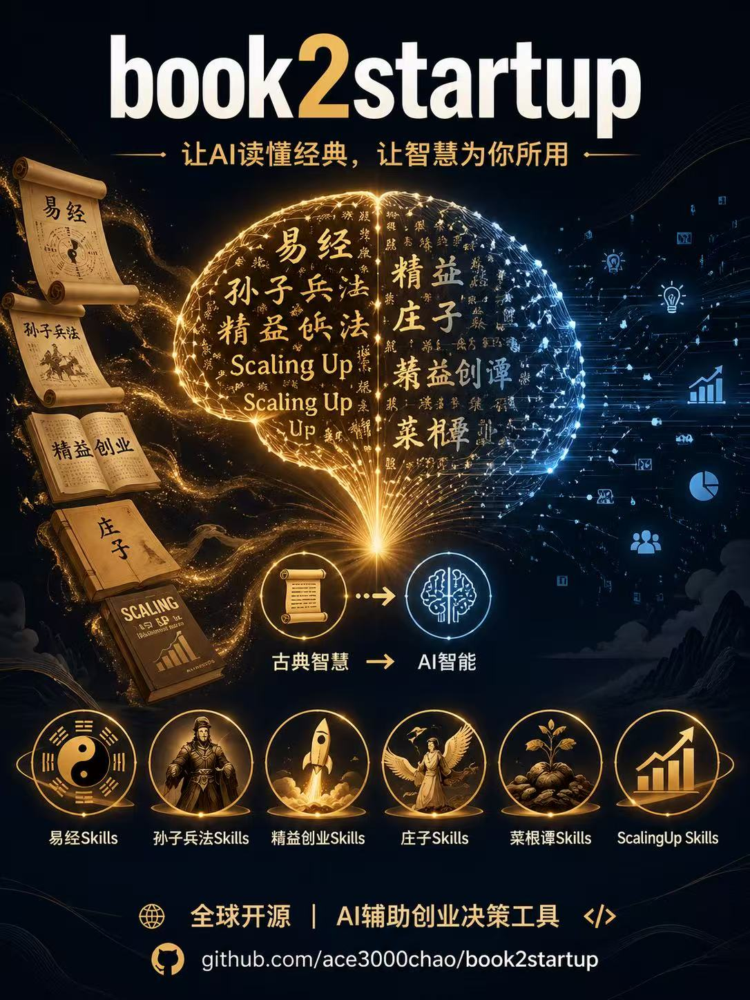
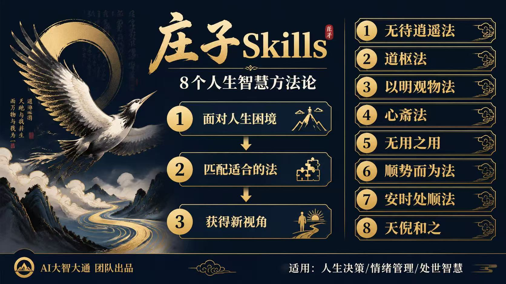
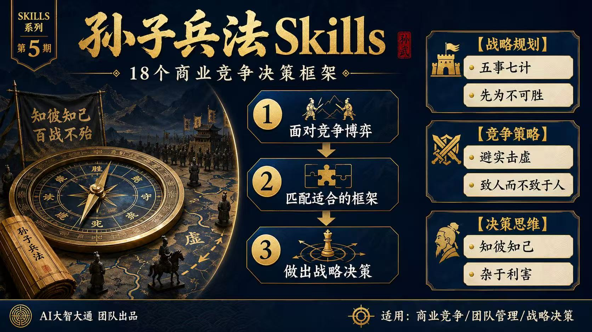
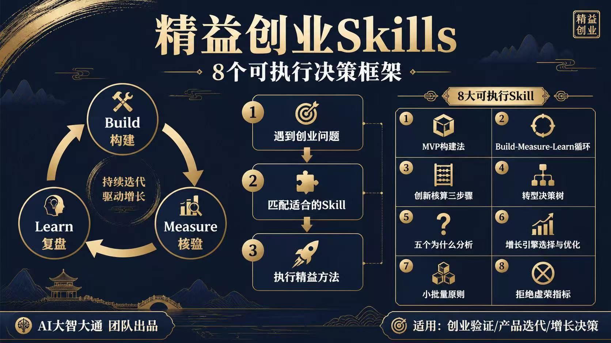
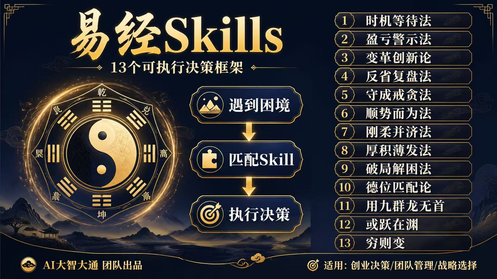
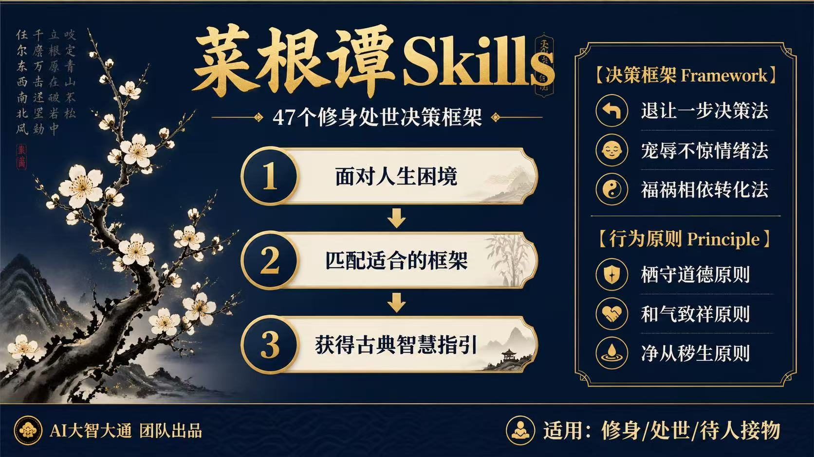
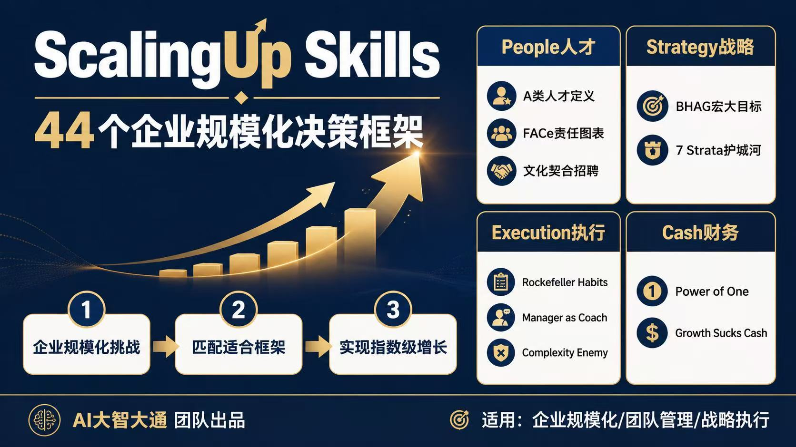

# book2startup — 经典书籍Skills工具箱

> 从经典书籍中蒸馏AI-Agent可用的Skills，让知识真正转化为创业者的认知框架和执行方案

[](https://opensource.org/licenses/MIT)
[](https://github.com/kangarooking/cangjie-skill)

---

## 🎯 项目简介

**book2startup** （中文名“知本创业法”——以知识为本，用可复制的方法做创业）是一个将经典书籍蒸馏为可执行AI-Agent Skills的工具箱。

我们的目标：

1. **帮助用户快速学习** — 每本书的核心理论框架被提炼成独立的Skill，即学即用
2. **让AI Agent持续使用** — Skills带有触发条件、适用边界和执行步骤，AI可在真实场景中自动调用
3. **知识转化为行动** — 不是书摘总结，而是可直接指导创业决策的方法论工具包

**核心理念**：一本书的真正价值不在于你知道它讲什么，而在于你知道**什么时候该用它**。



---

## 🎯 这些Skills能解决什么问题？

当你或你的AI Agent遇到这些问题时，book2startup的Skills可以提供有深度的思考框架：

| 你的问题是... | 使用... |
|--------------|---------|
| 该不该辞职创业，被别人怎么看捆绑 | [庄子·无待逍遥法](./庄子skills/) |
| 和合伙人在股权分配上各执一词 | [庄子·道枢法](./庄子skills/) |
| 信息太多越看越迷茫 | [庄子·以明观物法](./庄子skills/) |
| 大公司要进入你的市场 | [孙子兵法·避实击虚](./孙子兵法skills/) |
| 团队士气低落 | [孙子兵法·三军夺气](./孙子兵法skills/) |
| 面临选择不知该进还是退 | [孙子兵法·杂于利害](./孙子兵法skills/) |
| 创业想法如何用最小成本验证 | [精益创业·MVP构建法](./精益创业skills/) |
| 核心指标停滞了，是坚持还是转型 | [精益创业·转型决策树](./精益创业skills/) |
| 产品增长很慢怎么突破 | [精益创业·增长引擎选择](./精益创业skills/) |

---

## 📚 现有Skills一览

### 庄子Skills（8个可执行框架）

**来源**：《庄子》内篇七篇（无待逍遥/道枢/以明观物/心斋/无用之用/顺势而为/安时处顺/天倪和之）

**解决问题**：人生重大决策、人际冲突、复杂困境前的思考框架

**特色**：东方哲学思维，应对不确定性和人生困境

```
庄子skills/
├── skills/
│   ├── 无待逍遥法/     # 纠结要不要做某件事
│   ├── 道枢法/          # 和别人争论对错
│   ├── 以明观物法/      # 信息太多越看越迷茫
│   ├── 心斋法/          # 面对强权紧张
│   ├── 无用之用/        # 被"有什么用"质疑
│   ├── 顺势而为法/      # 复杂局面不知从何下手
│   ├── 安时处顺法/      # 面对无法改变的失败
│   └── 天倪和之/        # 和别人吵架立场对立
├── candidates/
├── rejected/
└── verified.md
```




### 孙子兵法Skills（18个可执行框架）

**来源**：《孙子兵法》十三篇（知彼知己/五事七计/避实击虚/致人而不致于人/奇正相生/合于利而动/杂于利害/先为不可胜/五间俱起/诡道十二法/投之亡地/十则围之五则攻之/三军夺气/兵之情主速/全胜为上/进不求名退不避罪/无所不备则无所不寡/势险节短）

**解决问题**：商业竞争、创业决策、团队管理中的战略战术判断

**特色**：东方兵家谋略，以小博大的竞争策略体系

```
孙子兵法skills/
├── skills/              # 18个Skill目录
│   ├── 知彼知己-框架/
│   ├── 五事七计-框架/
│   ├── 避实击虚/
│   ├── 致人而不致于人/
│   └── ...（共18个）
├── candidates/
│   ├── frameworks.md    # 39条框架候选
│   └── principles.md    # 67条原则候选
├── rejected/
└── verified.md
```




### 精益创业Skills（8个可执行框架）

**来源**：《精益创业》— Eric Ries（Build-Measure-Learn/MVP/创新核算/转型决策树/五个为什么/增长引擎/小批量/拒绝虚荣指标）

**解决问题**：产品开发迭代、创业进展衡量、增长瓶颈突破

**特色**：科学创业方法论，数字化验证假设

```
精益创业skills/
├── skills/              # 8个Skill目录
│   ├── 001-mvp构建法/
│   ├── 002-build-measure-learn/
│   ├── 003-innovation-accounting/
│   ├── 004-pivot-decision/
│   ├── 005-five-whys/
│   ├── 006-growth-engine/
│   ├── 007-small-batch/
│   └── 008-reject-vanity-metrics/
├── candidates/
├── rejected/
└── verified.md
```




### 易经Skills




### 菜根谭Skills




### ScalingUp-Skills



---

## 🔧 安装和使用

### 前提条件

- 一个支持Skills的AI Agent（如 [OpenClaw](https://github.com/openclaw/openclaw)、Claude等）
- 基本的Git操作能力

### 安装步骤

#### 方法1：克隆整个仓库

```bash
# 克隆gitee的book2startup仓库
git clone https://gitee.com/zhiyao-zhongshan-g_0/book2startup.git

# 或 GitHub的book2startup仓库
# git clone https://github.com/ace3000chao/book2startup.git

cd book2startup

# 查看所有Skills
ls -la */
```

#### 方法2：按需安装单个书的Skills

```bash
# 只安装孙子兵法Skills
git clone https://gitee.com/zhiyao-zhongshan-g_0/book2startup/孙子兵法skills.git

# 只安装精益创业Skills
git clone https://gitee.com/zhiyao-zhongshan-g_0/book2startup/精益创业skills.git
```

### 使用方法

#### 方式1：在AI对话中直接引用（推荐）

当你遇到问题时，让AI读取对应的SKILL.md：

```
请读取 book2startup/孙子兵法skills/避实击虚/SKILL.md，
然后帮我分析：竞品刚融了5000万要碾压我们，我该怎么办？
```

#### 方式2：让AI系统学习后自动调用

```
请学习 book2startup/ 仓库中的所有Skills，
特别是每个书的INDEX.md了解整体框架。
当你认为适合调用某个书的Skills时，主动使用。
```

#### 方式3：导入到你的AI Agent配置

在你使用的AI平台系统提示中预设：

```
你擅长使用经典理论框架解决问题。
你可以调用 book2startup/ 中的Skills进行分析：
- 《庄子》Skills：应对人生困境和人际冲突
- 《孙子兵法》Skills：应对商业竞争和创业决策
- 《精益创业》Skills：应对产品开发和增长瓶颈
推荐先用各书的INDEX.md了解整体框架。
```

---

## 🧠 这些Skills是怎么生成出来的？

本项目的Skills使用 [book2skill](https://github.com/cangjie-skill/book2skill) 方法论自动生成。

### 核心原理

**不是压缩，是蒸馏。**

一本书几百万字，但真正能变成"可调用工具"的内容可能只有几千字。book2skill的流水线帮我们：

1. 识别书中真正有价值的框架/原则（而不是照单全收）
2. 加上触发条件和使用边界（而不是泛泛而谈）
3. 包装成AI Agent可执行的格式（而不是人类阅读笔记）

### 六阶段流水线

```
阶段0：整书理解
    ↓  Adler四步法
BOOK_OVERVIEW.md（万字全书骨架）

阶段1：5个并行提取器同时工作
    ├── 框架提取器
    ├── 原则提取器
    ├── 案例提取器
    ├── 反例提取器
    └── 术语词典
    ↓
candidates/（原始候选池）

阶段1.5：三重验证筛选
    ├── V1 跨域验证（≥2章节独立佐证）
    ├── V2 预测力验证（能回答书外新问题）
    └── V3 独特性验证（非常识性真理）
    ↓ 通过率约25-50%
verified.md（验证通过列表）

阶段2：RIA++六段构造
    ├── R — Reading（原文引用）
    ├── I — Interpretation（方法论骨架）
    ├── A1 — 书中案例
    ├── A2 — 未来触发情境
    ├── E — Execution（可执行步骤）
    └── B — Boundary（边界）
    ↓
skills/*/SKILL.md

阶段3：Zettelkasten链接
    ↓ 建立Skills间引用关系
INDEX.md（技能地图+学习路径）

阶段4：压力测试
    ↓ 诱饵测试+边界场景
skills/*/test-prompts.json
```

### 三重验证标准

每个候选必须通过：

| 验证 | 问题 | 通过条件 |
|------|------|---------|
| **V1 跨域** | 书中至少有2个独立章节有佐证？ | ✓ |
| **V2 预测力** | 能用它回答书里没明说的新问题？ | ✓ |
| **V3 独特性** | 不是任何聪明人都会说的常识？ | ✓ |

---

## 📁 仓库结构

```
book2startup/
├── README.md                      # 📌 你现在正在看的文档
│
├── 庄子skills/                    # 🌿 东方哲学·应对不确定性
│   ├── README.md
│   ├── INDEX.md
│   ├── BOOK_OVERVIEW.md
│   ├── skills/                    # 8个可执行框架
│   ├── candidates/
│   ├── rejected/
│   └── verified.md
│
├── 孙子兵法skills/                # ⚔️ 东方兵法·应对竞争策略
│   ├── README.md
│   ├── INDEX.md
│   ├── BOOK_OVERVIEW.md
│   ├── skills/                    # 18个可执行框架
│   ├── candidates/
│   ├── rejected/
│   └── verified.md
│
├── 精益创业skills/                # 🚀 科学创业·应对产品增长
│   ├── README.md
│   ├── INDEX.md
│   ├── BOOK_OVERVIEW.md
│   ├── skills/                    # 8个可执行框架
│   ├── candidates/
│   ├── rejected/
│   └── verified.md
│
└── 未来还会有更多<书名>skills/     # 📚 持续扩充中
```

---

## 🚀 未来规划

### 近期计划蒸馏的书

| 书名 | 方向 | 预计Skills数 |
|------|------|-------------|
| 毛泽东选集 | 东方战略思想 | 15+ |
| 失控/有限与无限的游戏 | 系统思维 | 10+ |
| 定位系列 | 市场营销 | 8+ |
| 商君书/韩非子 | 法家管理 | 8+ |

### 长期愿景

1. **覆盖创业全场景** — 从自我认知（庄子）→ 竞争策略（孙子）→ 产品方法（精益创业）→ 扩展到更多维度
2. **跨书Skills组合** — 同一问题可用多个书的框架交叉验证
3. **实战案例库** — 积累各Skills在真实创业场景中的应用案例

### 贡献方式

欢迎提交Issue或PR：
- 报告某个Skill的触发条件不准确
- 贡献新的应用案例
- 推荐想蒸馏的新书
- 完善现有Skill的边界说明

---

## ✨ 效果示例

### 使用book2startup Skills前 vs 使用后

**场景**：大公司要进入你的市场，你该怎么办？

**使用前（普通AI）**：
> "要保持冷静，分析竞争格局，提升产品竞争力..."

**使用"避实击虚"Skill后（孙子兵法）**：
> **避实击虚 · 框架分析**
>
> 核心洞察：水之形，避高而趋下；兵之形，避实而击虚。
>
> **三步走策略**：
> 1. **画"虚实地图"** — 对手重兵投入的地方（实）vs 忽视的地方（虚）
> 2. **找"一卒可胜"** — 在"虚"中选择一个足够锋利的切入点
> 3. **建立"敌变我变"机制** — 保持敏捷，不在旧战场恋战
>
> **案例参考：** 拼多多崛起——阿里京东主攻"消费升级"（实），拼多多选择"下沉市场"（虚）

---

## 📜 许可证

本项目采用 **MIT 许可证**。

- 你可以自由使用、修改、分发这些Skills
- 无需署名，但欢迎star支持
- 商业化亦可

详见 [LICENSE](./LICENSE) 文件。

---

## 🙏 致谢

- **原著作者**：庄周、孙武、Eric Ries 等经典书籍作者
- **蒸馏方法**：基于 [book2skill](https://github.com/kangarooking/cangjie-skill) 方法论
- **AI-Agent工具**：[OpenClaw](https://github.com/openclaw/openclaw)
- **启发来源**：袋鼠帝 kangarooking 的 [cangjie-skill](https://github.com/kangarooking/cangjie-skill) 项目

---

## 📬 联系方式

- **Gitee**：https://gitee.com/zhiyao-zhongshan-g_0/
- **GitHub**：https://github.com/ace3000chao/

---

*"知彼知己，胜乃不殆；知天知地，胜乃可全。" ——《孙子兵法》*

*"至人无己，神人无功，圣人无名。" ——《庄子·逍遥游》*

---

**如果这个项目对你有帮助，欢迎给它一个 ⭐！**
