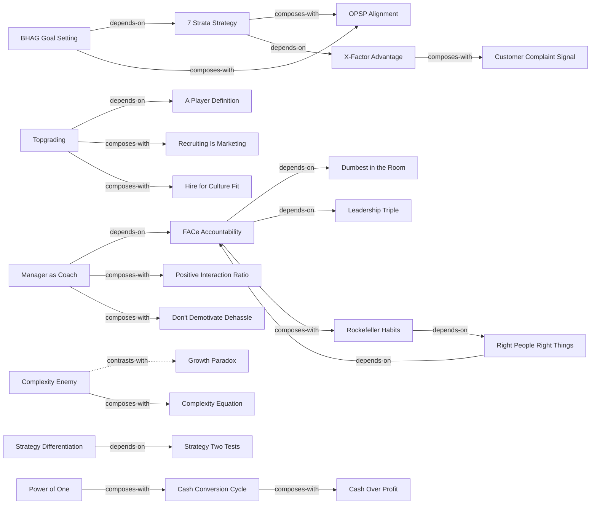

# Scaling Up — Skill Index

> 本书由 book2skill 蒸馏, 共产出 **44** 个 skills。
> 处理时间: 2026-04-26

## 关于这本书

- **作者**: Verne Harnish
- **出版年**: 2014
- **一句话主旨**: 如何将企业从创业阶段规模化扩张到行业领先
- **整书理解**: 见 [BOOK_OVERVIEW.md](./BOOK_OVERVIEW.md)

---

## Skill 列表 (按主题分组)

### People

- [`a-player-definition`](./a-player-definition/SKILL.md) — A类人才的定义标准
- [`dumbest-in-the-room`](./dumbest-in-the-room/SKILL.md) — 授权后退出，做"最蠢"的那个
- [`face-accountability-chart`](./face-accountability-chart/SKILL.md) — FACe accountability chart组织架构法
- [`fairness-not-sameness`](./fairness-not-sameness/SKILL.md) — 公平不等于相同，差异化激励
- [`first-rate-talent-coach`](./first-rate-talent-coach/SKILL.md) — 一流人才也需要教练
- [`hire-for-culture-fit`](./hire-for-culture-fit/SKILL.md) — 招聘时注重文化契合
- [`hr-systems-align-values`](./hr-systems-align-values/SKILL.md) — HR系统要与核心价值观对齐
- [`leadership-triple`](./leadership-triple/SKILL.md) — 领导力三要素：预测/授权/重复
- [`onboarding-culture-immersion`](./onboarding-culture-immersion/SKILL.md) — 入职沉浸式文化融入
- [`pace-process-chart`](./pace-process-chart/SKILL.md) — PACE流程图，追踪关键动作
- [`positive-interaction-ratio`](./positive-interaction-ratio/SKILL.md) — 正向互动比率，管理情绪氛围
- [`recruiting-is-marketing`](./recruiting-is-marketing/SKILL.md) — 招聘即营销，主动出击
- [`right-people-right-things`](./right-people-right-things/SKILL.md) — 对的人做对的事
- [`topgrading`](./topgrading/SKILL.md) — Topgrading A类人才招聘系统
- [`will-values-results-skills`](./will-values-results-skills/SKILL.md) — 选人看意愿、价值观、结果、技能

### Strategy

- [`4d-framework`](./4d-framework/SKILL.md) — 决策四维度框架
- [`7-strata-strategy`](./7-strata-strategy/SKILL.md) — 七层战略体系
- [`bhag-goal-setting`](./bhag-goal-setting/SKILL.md) — BHAG宏大冒险目标设定
- [`bhag-25year`](./bhag-25year/SKILL.md) — 25年BHAG长期愿景
- [`opsp-alignment`](./opsp-alignment/SKILL.md) — OPSP一页纸战略规划与全员对齐
- [`strategic-thinking-council`](./strategic-thinking-council/SKILL.md) — 战略思考委员会
- [`strategy-diff-exec`](./strategy-diff-exec/SKILL.md) — 战略差异化与执行的区别
- [`strategy-two-tests`](./strategy-two-tests/SKILL.md) — 战略两测试验证法
- [`swt-analysis`](./swt-analysis/SKILL.md) — SWOT分析法
- [`x-factor-advantage`](./x-factor-advantage/SKILL.md) — X-Factor护城河优势

### Execution

- [`10-rockefeller-habits`](./10-rockefeller-habits/SKILL.md) — 十大洛克菲勒习惯
- [`complexity-enemy`](./complexity-enemy/SKILL.md) — 复杂度是组织成长的敌人
- [`complexity-equation`](./complexity-equation/SKILL.md) — 复杂度方程定量分析
- [`dont-demotivate-dehassle`](./dont-demotivate-dehassle/SKILL.md) — 不要去激励，去除障碍
- [`fast-pulse-fast-growth`](./fast-pulse-fast-growth/SKILL.md) — 快脉搏快增长，组织节奏设计
- [`growth-paradox`](./growth-paradox/SKILL.md) — 增长悖论：越大越累
- [`habits-quarterly-rotation`](./habits-quarterly-rotation/SKILL.md) — 习惯季度轮换推行法
- [`less-is-more-priorities`](./less-is-more-priorities/SKILL.md) — 少即是多，战略聚焦
- [`manager-as-coach`](./manager-as-coach/SKILL.md) — 管理者即教练
- [`rockefeller-habits`](./rockefeller-habits/SKILL.md) — 洛克菲勒日习惯
- [`routine-sets-you-free`](./routine-sets-you-free/SKILL.md) — 例行公事让你自由
- [`weekly-stop-item`](./weekly-stop-item/SKILL.md) — 每周停止项，持续反馈

### Cash

- [`3x-industry-profitability`](./3x-industry-profitability/SKILL.md) — 三倍行业利润率目标
- [`cash-conversion-cycle`](./cash-conversion-cycle/SKILL.md) — 现金转换周期
- [`cash-over-profit`](./cash-over-profit/SKILL.md) — 现金流优先于利润
- [`coaching-returns`](./coaching-returns/SKILL.md) — 教练投资回报
- [`customer-complaint-signal`](./customer-complaint-signal/SKILL.md) — 客户投诉就是创新信号
- [`growth-sucks-cash`](./growth-sucks-cash/SKILL.md) — 增长吃现金
- [`power-of-one`](./power-of-one/SKILL.md) — 一的力量，定价与决策杠杆

---

## 引用图



图例:
- `-->`  depends-on
- `-.->` contrasts-with
- `===>` composes-with

---

## 推荐学习顺序

1. **Right People Right Things / A Player Definition** — 最基础：人才定义
2. **FACe / Topgrading** — 组织架构与招聘系统
3. **BHAG / 7 Strata** — 战略愿景与路径
4. **OPSP / Strategy Two Tests** — 战略落地与验证
5. **X-Factor / Strategy Differentiation** — 竞争优势构建
6. **Rockefeller Habits / Manager as Coach** — 执行体系与日常管理
7. **Complexity Enemy / Growth Paradox** — 复杂度管理与增长悖论
8. **Power of One / Cash Conversion Cycle** — 财务管理核心
9. **Weekly Stop Item / Less Is More** — 持续改进与战略聚焦

---

## 接入 darwin-skill

所有 skill 均带有 `test-prompts.json` (darwin-skill 兼容格式), 可直接接入自动进化:

```
darwin evolve books/scaling-up/
```

---

## 审计轨迹

- 候选单元池: [candidates/](./candidates/)
- 被淘汰的候选 (含原因): [rejected/](./rejected/)
- BOOK_OVERVIEW: [BOOK_OVERVIEW.md](./BOOK_OVERVIEW.md)
