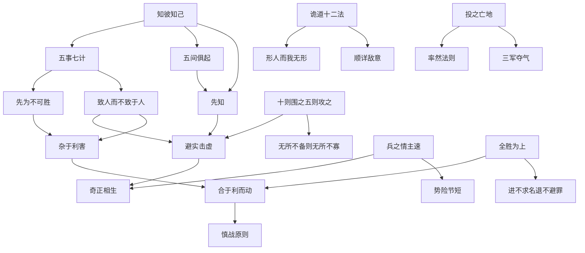

# 《孙子兵法》Skills 索引

## 总览

本索引包含从《孙子兵法》蒸馏的 **17个核心Skills**，覆盖战略规划、竞争分析、决策管理、情报获取、团队领导等关键维度。

## Skills 引用关系图



## Skills 目录

| # | Skill | 核心主题 | 来源篇 |
|---|-------|---------|--------|
| 1 | 知彼知己 | 决策情报框架 | 谋攻第三 |
| 2 | 五事七计 | 战略规划与竞争分析 | 始计第一 |
| 3 | 致人而不致于人 | 主动权掌控 | 虚实第六 |
| 4 | 避实击虚 | 竞争策略 | 虚实第六 |
| 5 | 奇正相生 | 创新与变化 | 兵势第五 |
| 6 | 合于利而动 | 理性决策 | 九地第十一 |
| 7 | 杂于利害 | 辩证思维 | 九变第八 |
| 8 | 先为不可胜 | 防御哲学 | 军形第四 |
| 9 | 五间俱起 | 情报网络 | 用间第十三 |
| 10 | **诡道十二法** | 示形惑敌 | 始计第一 |
| 11 | **投之亡地** | 绝境激发 | 九地第十一 |
| 12 | **十则围之五则攻之** | 兵力对比决策 | 谋攻第三 |
| 13 | **三军夺气** | 攻心策略 | 军争第七 |
| 14 | **兵之情主速** | 速度法则 | 军争第七 |
| 15 | **全胜为上** | 不战而屈 | 谋攻第三 |
| 16 | **进不求名退不避罪** | 独立担当 | 地形第十 |
| 17 | **无所不备则无所不寡** | 集中原则 | 虚实第六 |
| 18 | **势险节短** | 攻势节奏 | 兵势第五 |

## 核心方法论链条

### 决策链条
```
五事七计（战略规划）
    ↓
知彼知己（情报收集）
    ↓
杂于利害（辩证分析）
    ↓
合于利而动（理性决策）
    ↓
慎战原则（战前最终过滤）
```

### 竞争链条
```
先为不可胜（防守优先）
    ↓
致人而不致于人（掌握主动）
    ↓
避实击虚（以小博大）
    ↓
奇正相生（出奇制胜）
```

### 领导力链条
```
将将静幽正治（将领素质）
    ↓
令之以文齐之以武（团队管理）
    ↓
三军夺气（士气激励）
    ↓
进不求名退不避罪（独立担当）
```

## 使用场景索引

| 场景 | 推荐Skills |
|------|-----------|
| 创业立项评估 | 知彼知己 → 五事七计 → 合于利而动 |
| 竞争分析 | 五事七计 → 知彼知己 → 致人而不致于人 |
| 产品创新 | 奇正相生 → 避实击虚 → 兵之情主速 |
| 团队管理 | 三军夺气 → 投之亡地 → 进不求名退不避罪 |
| 市场进入 | 五间俱起 → 避实击虚 → 知彼知己 |
| 重大决策 | 杂于利害 → 合于利而动 → 全胜为上 |
| 防守构建 | 先为不可胜 → 无所不备则无所不寡 |
| 出其不意 | 诡道十二法 → 顺详敌意 → 兵之情主速 |

---

*本索引由book2skill流水线生成 | 更新：2026-04-19*
