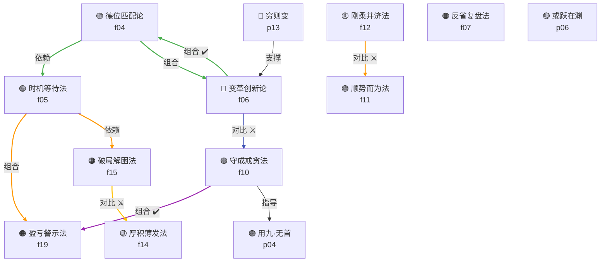

# 易经 · Skills 索引

> book2skill 流水线阶段3产出 | 2026-04-21

---

## 📖 书的基本信息

| 字段 | 内容 |
|------|------|
| **书名** | 易经（周易） |
| **作者** | 伏羲（八卦创始）、文王（卦辞）、周公（爻辞）、孔子（十翼） |
| **成书年代** | 约公元前11世纪（周朝） |
| **版本来源** | 蒸馏书籍《易经》 |
| **一句话主旨** | 管理国家之重典，规划未来与厚德处事 |

---

## 🎯 整体主旨

《易经》是中华古代圣人集体创作的治国理政方法论体系，通过六十四卦符号系统阐述帝王如何规划未来、厚德处事、谨慎行事、团结百姓。

---

## 🧩 13个Skill 总览

### 主题分组

#### 壹·定位与时机（看清局势）
| ID | Skill | 源码 |
|----|-------|------|
| f04 | **德位匹配论** | 乾卦·文言传 |
| f05 | **时机等待法** | 需卦 |
| f11 | **顺势而为法** | 豫卦·随卦 |

#### 贰·行动与变革（推动改变）
| ID | Skill | 源码 |
|----|-------|------|
| f06 | **变革创新论** | 革卦·鼎卦 |
| f12 | **刚柔并济法** | 大壮卦·遯卦 |
| f14 | **厚积薄发法** | 大畜卦·无妄卦 |
| p13 | **穷则变，变则通** | 系辞下·第二章 |

#### 叁·困境与复盘（应对危机）
| ID | Skill | 源码 |
|----|-------|------|
| f15 | **破局解困法** | 解卦·蹇卦 |
| f07 | **反省复盘法** | 复卦·无妄卦 |
| f19 | **盈亏警示法** | 泰卦·否卦·丰卦 |

#### 肆·守成与警醒（保持成果）
| ID | Skill | 源码 |
|----|-------|------|
| f10 | **守成戒贪法** | 乾卦·节卦 |
| p04 | **用九·见群龙无首** | 乾卦·用九 |
| p06 | **或跃在渊·进无咎** | 乾卦·九四 |

---

## 🗺️ Skill 引用关系图

### 关系说明

| 关系类型 | 含义 |
|----------|------|
| **依赖** | A使用前需先完成B（B是前提） |
| **组合** | A与B配合使用效果更佳 |
| **对比** | A与B适用场景相反，需择一使用 |

---

## 📚 推荐学习顺序

### 第一阶段：筑基（理解易经思维）
1. **德位匹配论** (f04) — 判断自己是否有资格承担当前角色
2. **时机等待法** (f05) — 判断外部条件是否成熟

> 原因：这两个skill帮用户建立"我是谁+我在什么环境"的自我诊断框架，是所有后续行动的基础。

### 第二阶段：行动（推动改变）
3. **顺势而为法** (f11) — 看清规律再行动
4. **变革创新论** (f06) — 有基础后推进变革
5. **穷则变，变则通** (p13) — 变革的时机原则

> 原因：先顺后再变，符合"先观察再行动"的原则。

### 第三阶段：调节（动态平衡）
6. **刚柔并济法** (f12) — 何时该刚，何时该柔
7. **厚积薄发法** (f14) — 积累到什么程度可以出手

> 原因：解决"变的过程中如何调整强度"的问题。

### 第四阶段：守成（保持成果）
8. **守成戒贪法** (f10) — 成功后如何不亢龙有悔
9. **用九·见群龙无首** (p04) — 集体决策避免一言堂
10. **盈亏警示法** (f19) — 建立预警机制

> 原因：成功后是问题最多的时候，需要预警+节制。

### 第五阶段：困境（应对危机）
11. **破局解困法** (f15) — 困境中的进退抉择
12. **反省复盘法** (f07) — 错误后如何修正
13. **或跃在渊·进无咎** (p06) — 进阶时机的精准判断

> 原因：收尾于"进阶时机判断"，形成完整的决策闭环。

---

## 📂 Skill 文件夹

| Skill | 目录 |
|-------|------|
| de-wei-pipei | `de-wei-pipei/` |
| shi-ji-deng-dai | `shi-ji-deng-dai/` |
| bian-ge-chuang-xin | `bian-ge-chuang-xin/` |
| fan-xing-fu-pan | `fan-xing-fu-pan/` |
| shou-cheng-jie-tan | `shou-cheng-jie-tan/` |
| shun-shi-er-wei | `shun-shi-er-wei/` |
| gang-rou-bing-ji | `gang-rou-bing-ji/` |
| hou-ji-bo-fa | `hou-ji-bo-fa/` |
| po-ju-jie-kun | `po-ju-jie-kun/` |
| ying-kui-jing-shi | `ying-kui-jing-shi/` |
| yong-jiu-qun-long | `yong-jiu-qun-long/` |
| huo-yue-zai-yuan | `huo-yue-zai-yuan/` |
| qiong-ze-bian | `qiong-ze-bian/` |

---

**质量门**: INDEX.md 包含书信息 ✓ / 一句话主旨 ✓ / 13个Skill列表 ✓ / Mermaid引用图 ✓ / 推荐学习顺序 ✓
